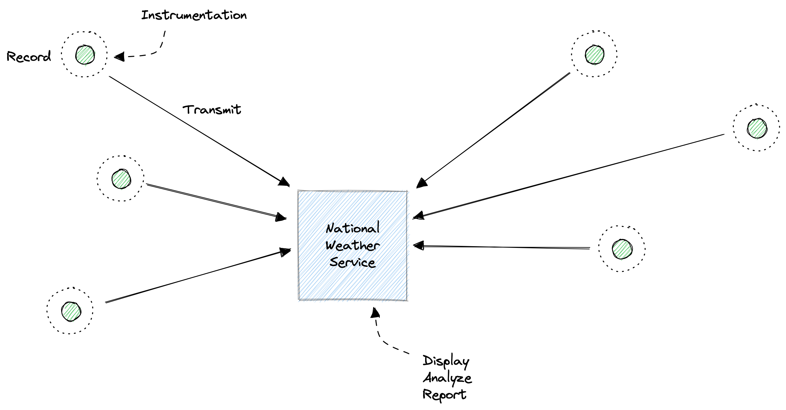

<Callout variant="course">

This lesson is a part of our OpenTelemetry masterclass. If you haven't already, checkout the [chapter introduction](/opentelemetry-masterclass/fundamentals).

</Callout>

Telemetry, as defined in its broadest context, is a process that involves collecting data that's measured by an instrument and sending that data to some receiver. For example, in the United States, the National Weather Service releases weather balloons every day, all around the country, to measure the conditions of the atmosphere, such as air pressure, humidity, and wind velocity. Once captured, these measurements are sent to the agency for analysis, display, and report. This process is telemetry.

In software, telemetry data most commonly refers to data that describes how an application is used and how it performs. This includes metrics, like the time it takes a web service to respond to a request; events, like when a user clicks a submit button in a signup form; and more. When you measure these metrics, events, logs, traces, and so on, you typically send them to a backend observability platform, like New Relic, where you display, analyze, and respond to them.

<Callout variant="course">

This lesson is a part of our OpenTelemetry masterclass. Continue on to the next lesson: [Telemetry data types](/opentelemetry-masterclass/fundamentals/telemetry-data-types).

</Callout>