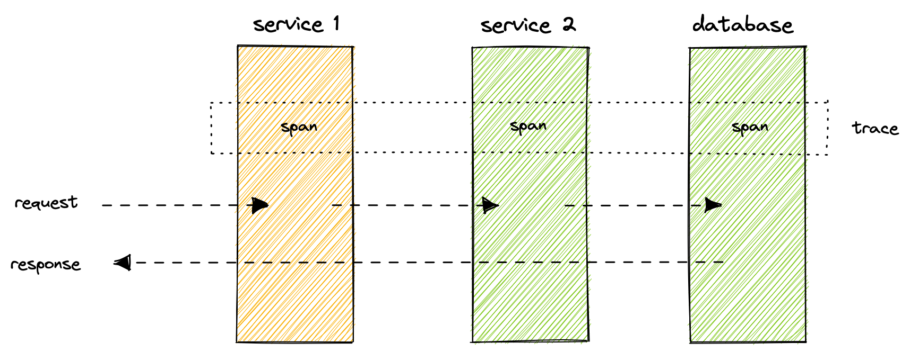
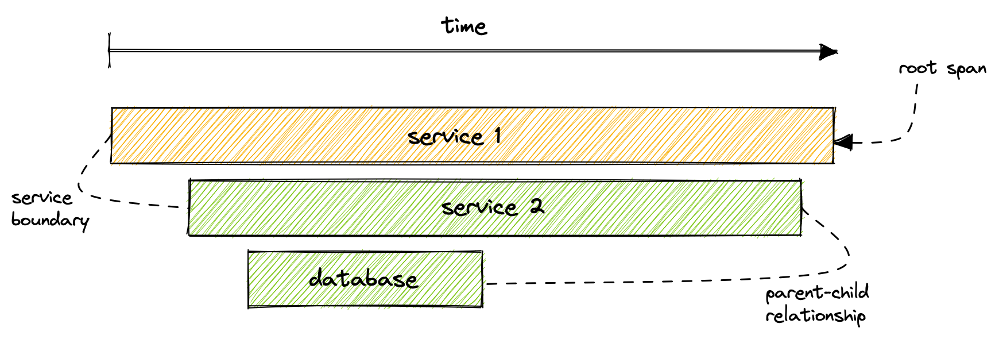

<Callout variant="course">

This lesson is a part of our OpenTelemetry masterclass. If you haven't already, checkout the [chapter introduction](/opentelemetry-masterclass/fundamentals).

Each lesson in this lab builds on the last one, so make sure you learn about [telemetry data types](/opentelemetry-masterclass/fundamentals/telemetry-data-types) before proceeding with this one.

</Callout>

Traces capture details of requests as they move through a system. They’re composed of spans, which are data structures that represent individual operations in the flow of execution.

For example, imagine a user requests data from your web service. In order to compute its response, your service calls a second service. This one reads from its database and returns the results up the stack and, eventually, back to the user. Every time the user's request hops between these processes, a span is created, capturing data about that individual operation. Together these spans form a trace.

A span contains metadata about the operation it represents, such as its name, start time, and end time. It also contains attributes formatted in key-value pairs and events, which contain metadata and attributes of their own.

Technically, a trace is defined as a series of spans that have the same trace ID. Each span also has its own unique identifier as well as one for its parent span, the one that triggered the present span to start. The parent-child relationship, established by the parent span's ID, is used to construct the order of operations in the trace. The starting point of the trace, the span without a parent ID, is called the root span.

Keep in mind that although this example contains spans that capture information for the duration of a request within each service, it’s also common to create child spans for operations that don’t cross service boundaries. For example, if service 2 reads from the database then calls a function to compute some value, you might create a child span for the duration of that function.

<Callout variant="tip" title="Distributed tracing">

A distributed trace is a trace that contains spans across service boundaries. In the example above, service 1 makes a request to service 2. Because the trace captures details about operations in both services, this is a distributed trace.

</Callout>

The purpose of capturing traces, and other telemetry data, is to send it to a backend platform where you can monitor the data, observe your service’s health, and learn how your users interact with it.

<Callout variant="course">

This lesson is a part of our OpenTelemetry masterclass. Continue on to the next lesson: [Telemetry and observability](/opentelemetry-masterclass/fundamentals/telemetry-and-observability).

</Callout>
