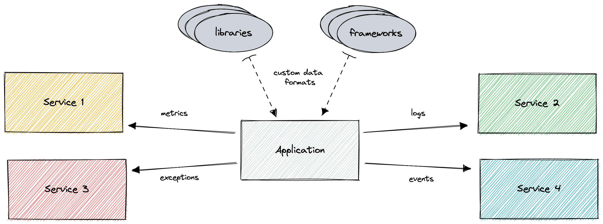

<Callout variant="course">

This lesson is a part of our OpenTelemetry masterclass. If you haven't already, checkout the [chapter introduction](/opentelemetry-masterclass/fundamentals).

Each lesson in this lab builds on the last one, so make sure you learn about [telemetry and observability](/opentelemetry-masterclass/fundamentals/telemetry-and-observability) before proceeding with this one.

</Callout>

With Observability platforms, you upload your telemetry data and observe the health and behaviors of your application. Naturally, the companies that create observability platforms also create software that provides the telemetry for their platform.

Developers often choose their observability platform first. The natural next step is to learn how to instrument their application so that it reports its telemetry data to their platform of choice. Often, this comes in the form of a proprietary agent or SDK. Other times, it might be a plugin or a platform-specific open source library or framework.

There are benefits to using software instrumentation built for your backend platform of choice. One of the biggest advantages to this approach is that tools built for your preferred backend don’t have to adhere to a standard or care about features that other platforms support. This means that development can move faster and cover all the features that the platform offers.

For a long time, this is how we’ve instrumented our applications. Consider, though, the drawbacks of this instrumentation method.

What if you want to use multiple observability platforms? What if the libraries and frameworks you use in your app offer custom data formats that you have to transform before you can send it to one of those platforms?

With the traditional methods of telemetry instrumentation, complex systems result in a host of tools you have to manage to make sure you’re collecting and sending data the way you want. If you later decide to change a backend platform or a supporting library or framework, you often need to completely replace the existing one. This can be a time-consuming process and a headache to manage.

The silver lining in all this is that just because developers have traditionally done telemetry this way, doesn’t mean it’s the only way. For a while, developers have been working on open source solutions for this problem. In particular, Google’s [OpenCensus](https://opencensus.io) and the Cloud Native Computing Foundation’s (CNCF) [OpenTracing](https://opentracing.io), aimed to solve this problem. Eventually, they merged into one: [OpenTelemetry](https://opentelemetry.io).

<Callout variant="course">

This lesson is a part of our OpenTelemetry masterclass. Continue on to the next lesson: [OpenTelemetry](/opentelemetry-masterclass/fundamentals/opentelemetry).

</Callout>
