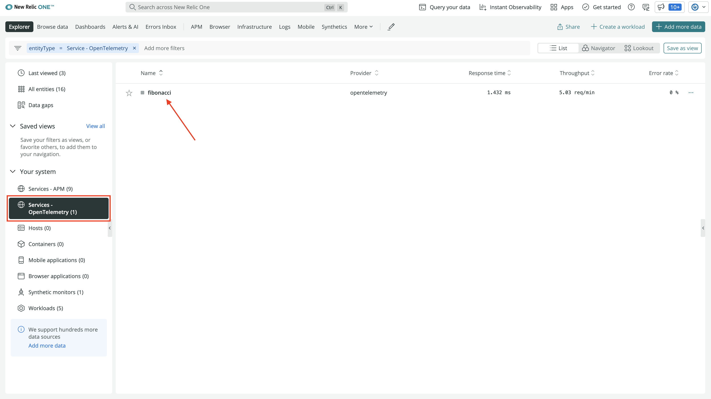
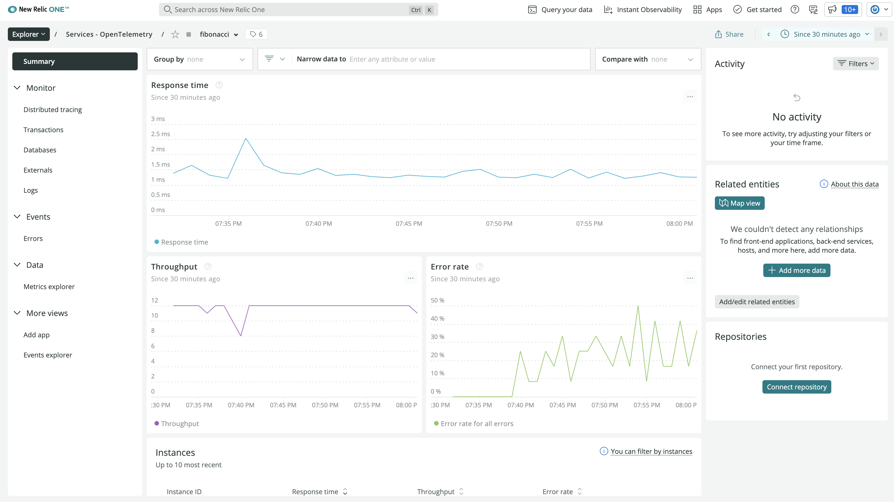

<Callout variant="course">

This lesson is a part of our OpenTelemetry masterclass. If you haven't already, checkout the [chapter introduction](/opentelemetry-masterclass/hands-on).

Each lesson in this lab builds on the last one, so make sure you read the [workshop introduction](/opentelemetry-masterclass/hands-on/workshop-introduction) before proceeding with this one.

</Callout>

Now that you’re sending your data to New Relic, use our platform to visualize and analyze your OpenTelemetry data.

First, go to [New Relic](https://one.newrelic.com):


Notice the OpenTelemetry services on your account homepage.

<Callout variant="tip" title="Troubleshooting">

You may have to wait a few minutes before seeing your results in New Relic. If you’re still not seeing results, remember to set your environment variable `NEW_RELIC_API_KEY` to your New Relic [license key](https://docs.newrelic.com/docs/apis/intro-apis/new-relic-api-keys/#ingest-license-key):

```shell
export NEW_RELIC_API_KEY=<YOUR_LICENSE_KEY>
```

Also, check your code against [ours](https://github.com/reese-lee/mcv3-apps/tree/master/Instrumented) to make sure you correctly instrumented your application.
</Callout>

Select **Services-OpenTelemetry** from the left-hand navigation, then choose your application:



Here, you see a summary of your OpenTelemetry service:



With only a few lines of OpenTelemetry instrumentation code, you see response times and the number of requests for your service. You also see a chart for the Error rate in your service.

Because you instrumented your application with the tracing API, head over to distributed tracing to view your trace data.

<Callout variant="course">

This lesson is a part of our OpenTelemetry masterclass. Continue on to the next lesson: [View your traces](/opentelemetry-masterclass/hands-on/traces).

</Callout>
