<Callout variant="course">

This lesson is a part of our OpenTelemetry masterclass. If you haven't already, checkout the [chapter introduction](/opentelemetry-masterclass/hands-on).

Each lesson in this lab builds on the last one, so make sure you [view your traces](/opentelemetry-masterclass/hands-on/traces) before proceeding with this one.

</Callout>

<Steps>

<Step>

From the left-hand navigation, select **Events > Errors**:

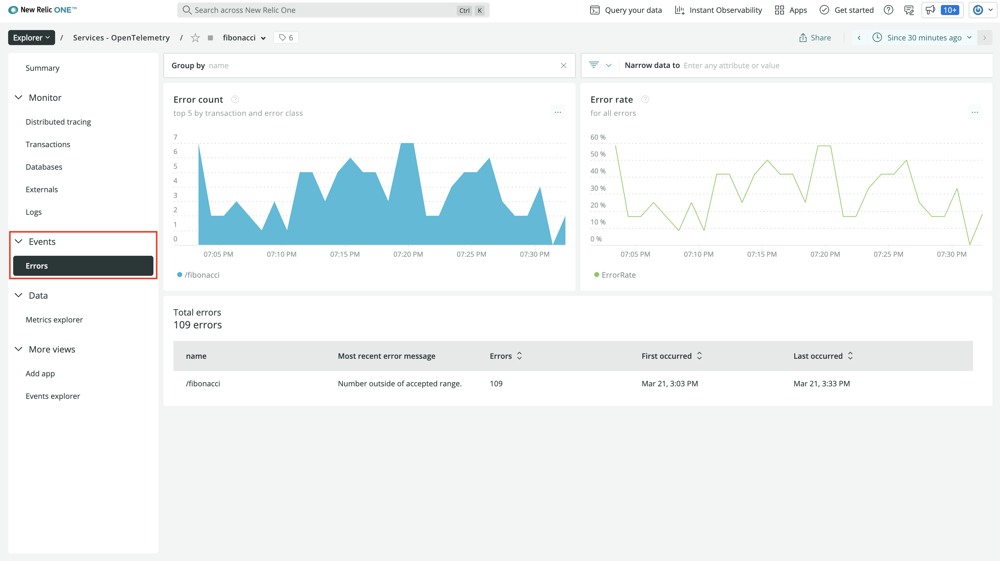

Here, you see the number of errors in your service over time, the error rate over time, and the total number of errors. This view is very similar to the one for **Distributed tracing**.

</Step>

<Step>

Click on the row in **Total Errors**:

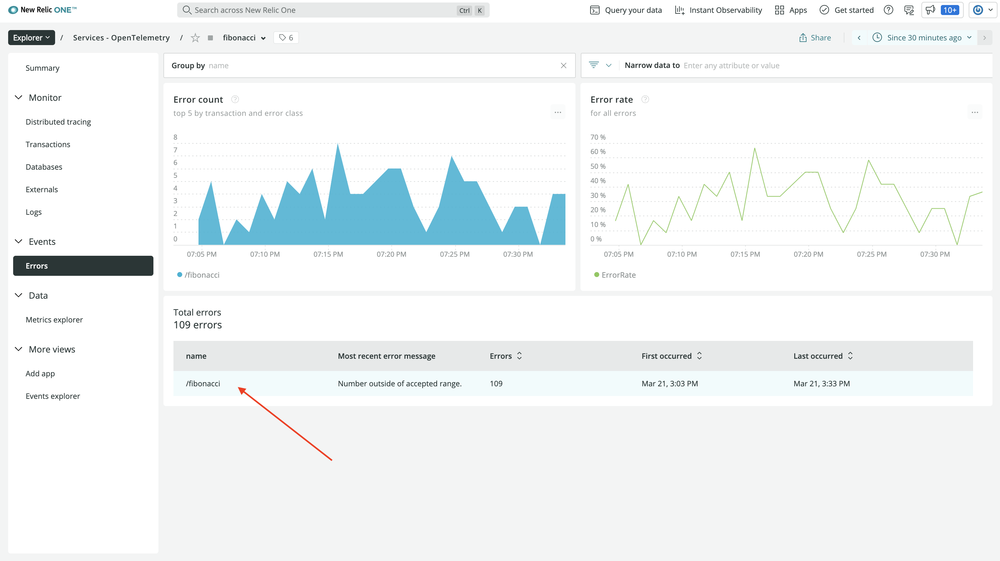

Here, you see more information about the errors. Remember, in your application, you raise an error when users request values for `n` that are less than 1 or higher than 90. Also remember that, in OpenTelemetry, exceptions are captured as span events.

At the top of the view, you see that the view is filtering traces in your service based on the `entity.guid` attribute, the root span’s name, and the error status code:

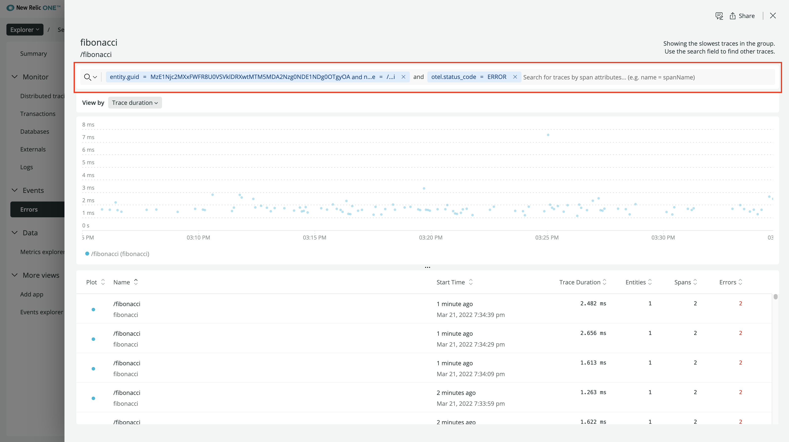

Under that, you can see the traces plotted on a timeline:

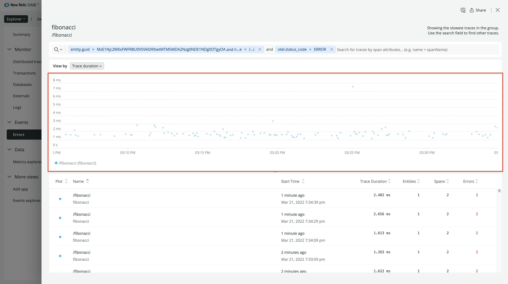

At the bottom, you see a table with the traces that have error spans:

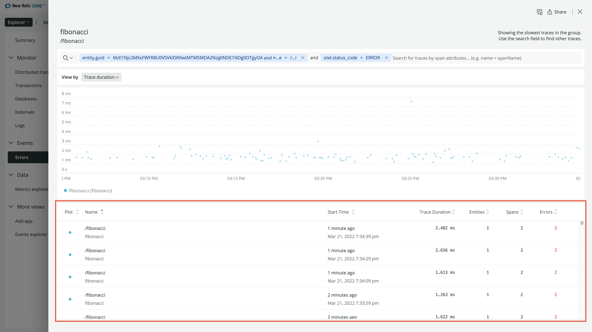

</Step>

<Step>

Click one of these traces:

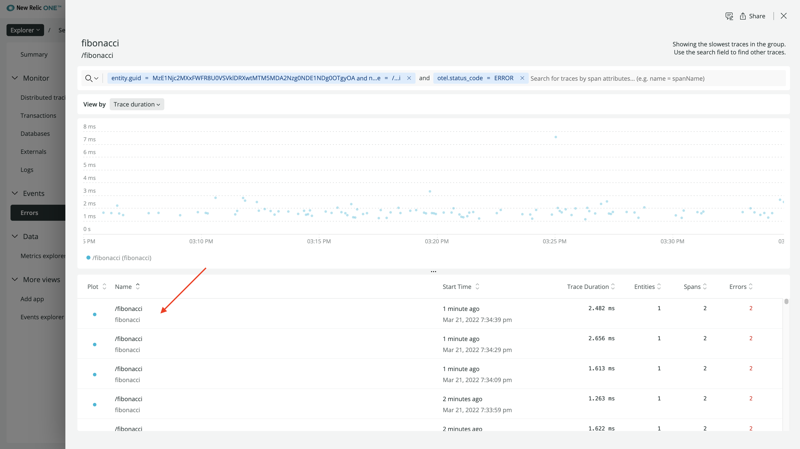

Once again, you see the timeline of the spans in your service. There are two red blocks, indicating error spans. Like before, on top is the root span. It’s the one named “HTTP GET”:

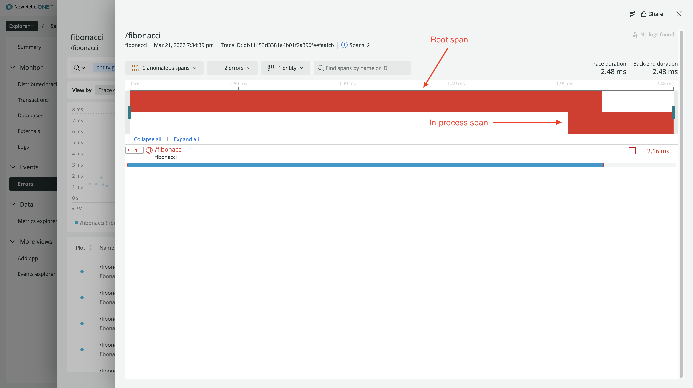

On the bottom is the in-process span:

Their red color indicates their error status.

</Step>

<Step>

Click the root span:

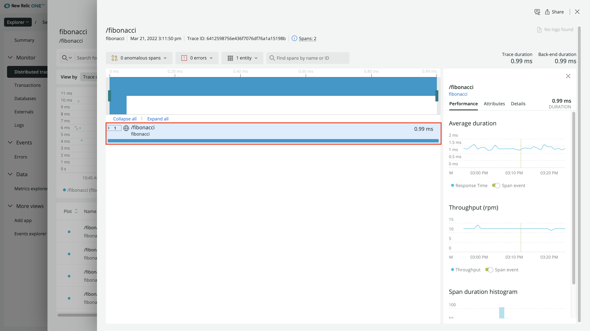

Near the top of the view, click **Error Details**:

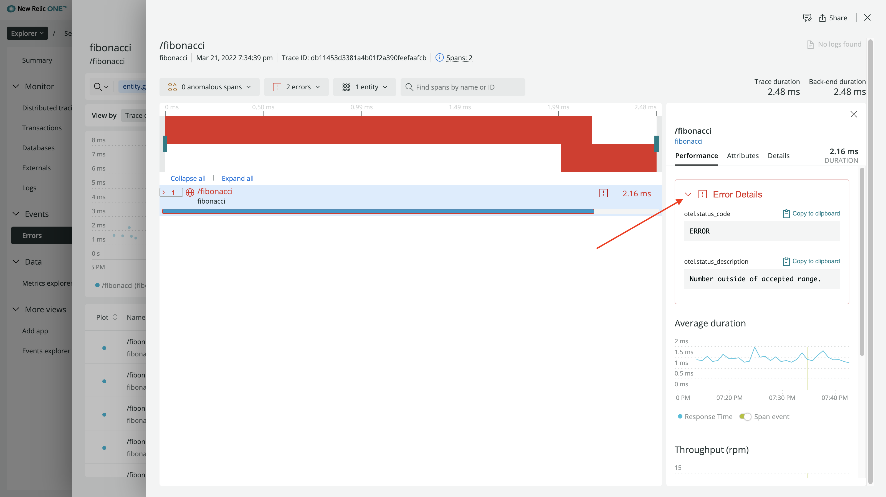

Here, you see the error status code and message you set when you instrumented your application. However, you can’t see any information about the actual exception because that was captured by the in-process span.

To see more information about your in-process span, expand the root span, and toggle **Display in-process spans for this service**:

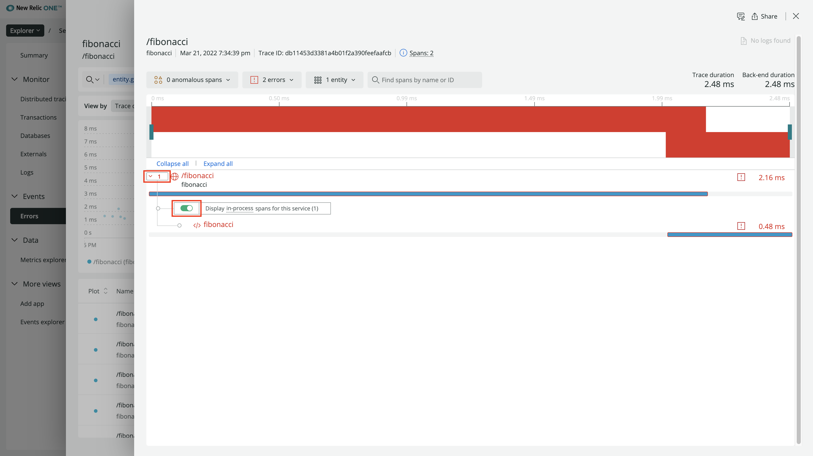

Click your in-process span:

This view is the same as the view for your root span but with data for your function instead of the overall request. Under **Attributes**, you’ll find your custom attribute:

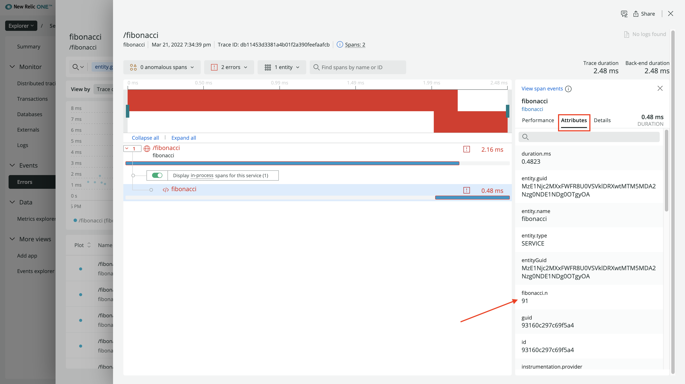

Note that, this time, there is no `oteldemo.result` attribute. This is because the user’s request caused your code to raise an exception and reject the request before it computed the result.

</Step>

<Step>

Under **Performance**, click **Error Details**:

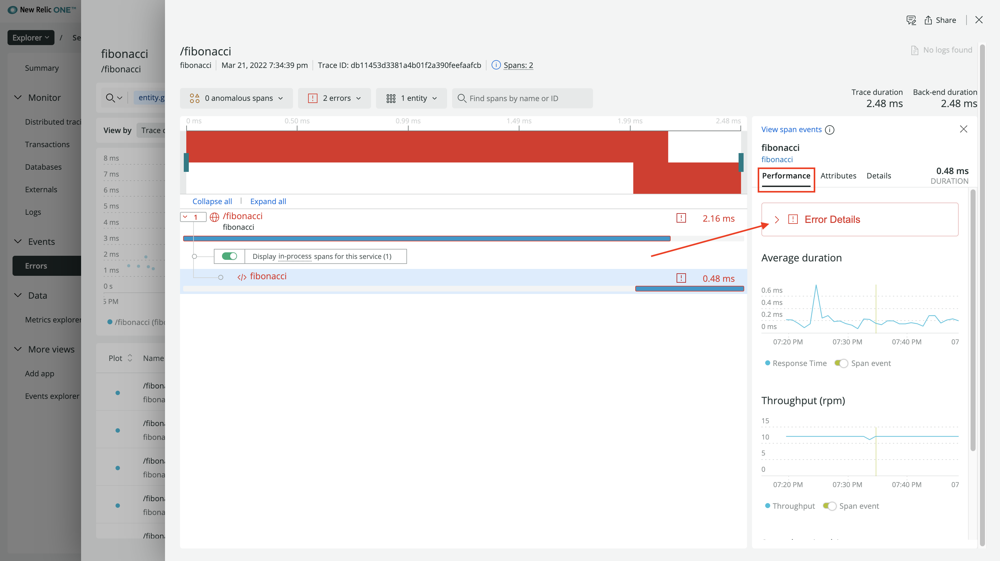

Notice there’s a new callout in this view:

> There was 1 span event exception

Because you captured an exception span event in your fibonacci function, you can see details about the event here.

</Step>

<Step>

Click to see your exception span event:

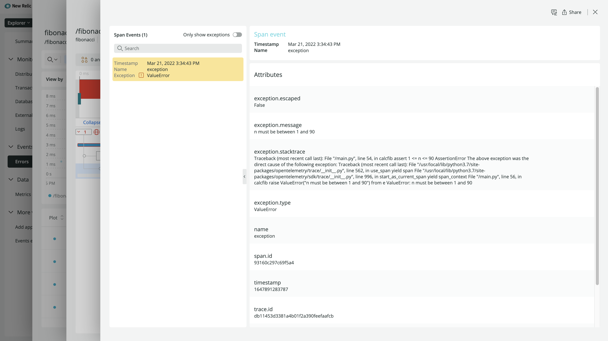

Here, you see the attributes for your span event, including the `exception.message` and `exception.stacktrace`.

</Step>

</Steps>

Now you've seen a few examples of how New Relic supports your OpenTelemetry data. But there's so much more that we offer than a data summary, a trace view, and an error view. Check out [our documentation](https://docs.newrelic.com/docs/more-integrations/open-source-telemetry-integrations/opentelemetry/view-your-opentelemetry-data-new-relic) to learn more!

## Conclusion

Congratulations on completing this course! You’ve learned a lot about OpenTelemetry, including the fundamentals of its specification and implementation as well as how to use it to provide the data you need to observe the behaviors and performance of your application.

Here’s a snapshot of what you learned:

| Fundamentals | Hands-on experience |
|:-:|:-:|
| ✓ Purpose and usefulness of OpenTelemetry | ✓ Applying OpenTelemetry instrumentation to your application |
| ✓ Data, API, and SDK specifications | ✓ New Relic’s support of OpenTelemetry traces |
| ✓ Language implementations ||

Now, you have a good foundation for using OpenTelemetry, but as there’s always more to learn, check out these resources to take your understanding to the next level:

- [OpenTelemetry official documentation](https://opentelemetry.io/docs/)
- [OpenTelemetry GitHub organization](https://github.com/open-telemetry)
- [OpenTelemetry on CNCF](https://landscape.cncf.io/card-mode?project=incubating&selected=open-telemetry)
- [OpenTelemetry at New Relic](https://docs.newrelic.com/docs/more-integrations/open-source-telemetry-integrations/opentelemetry/introduction-opentelemetry-new-relic/)