<Callout variant="course">

This lesson is a part of our OpenTelemetry masterclass. If you haven't already, checkout the [chapter introduction](/opentelemetry-masterclass/hands-on).

Each lesson in this lab builds on the last one, so make sure you [view a summary of your data](/opentelemetry-masterclass/hands-on/data-summary) before proceeding with this one.

</Callout>

Now that you've seen a summary of your OpenTelemetry data in New Relic, take a closer look at your traces.

<Steps>

<Step>

From the left-hand navigation, select **Distributed tracing**:

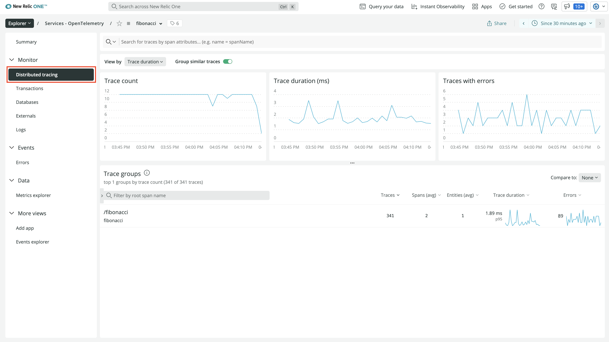

Here, you see some general information about traces in your service. You see the number of traces you receive over time, the duration of those traces, and the number of traces with errors. In the table at the bottom, you see [trace groups](https://docs.newrelic.com/docs/distributed-tracing/ui-data/understand-use-distributed-tracing-ui#trace-groups). These organize your traces, grouping them by their root span.

</Step>

<Step>

Click the **HTTP GET** trace group:

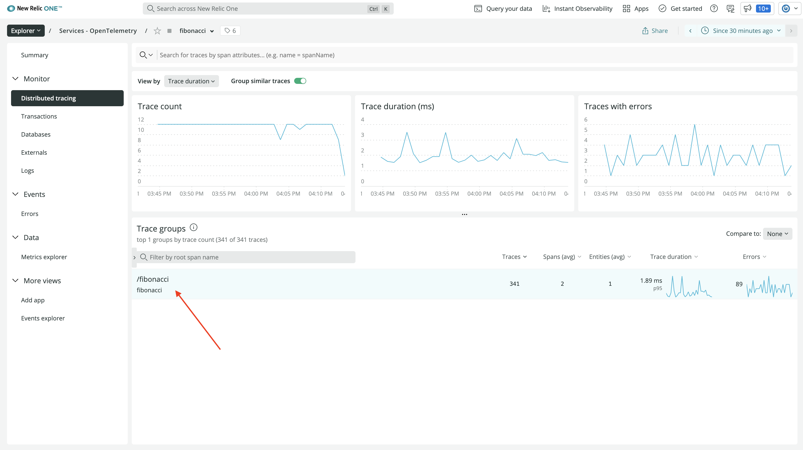

</Step>

<Step>

At the top, you see traces plotted on a timeline:

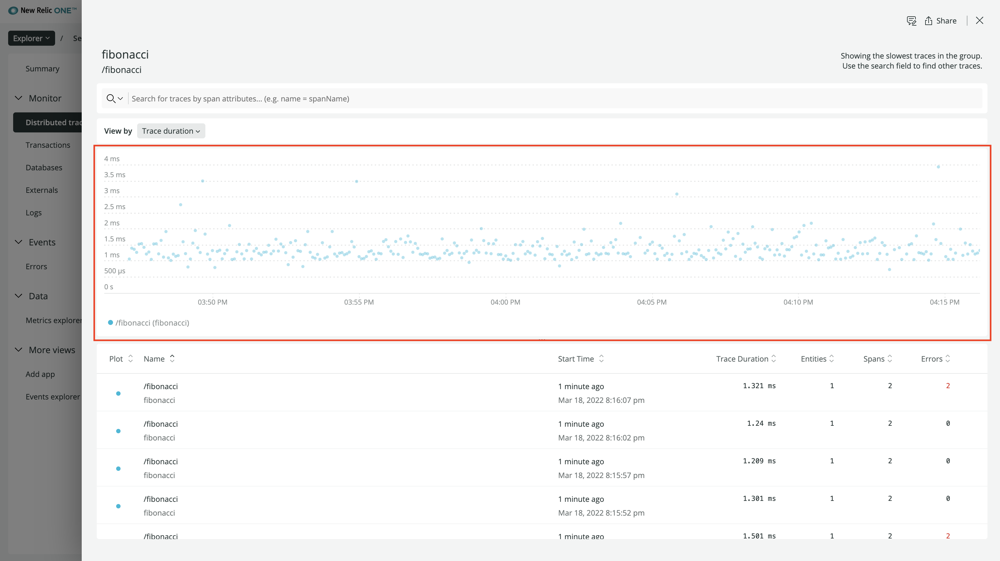

</Step>

<Step>

At the bottom, you see a chart with data for each of the traces:

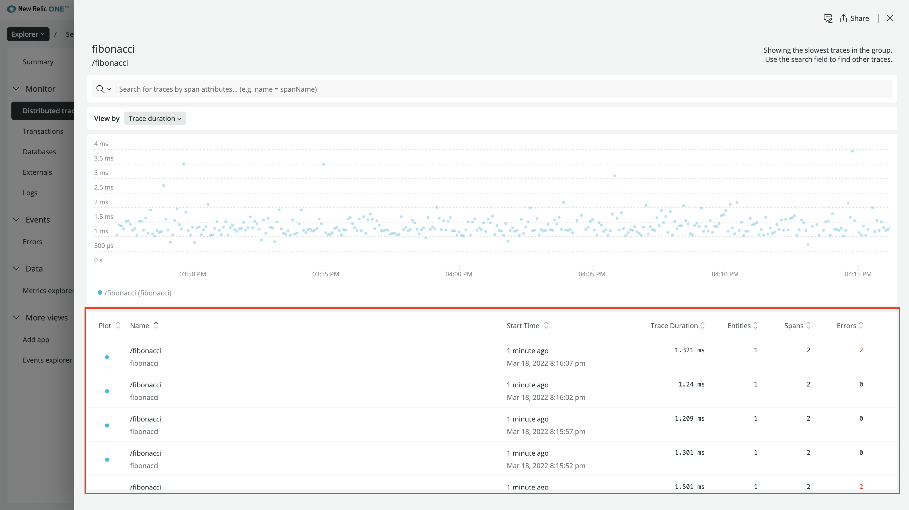

Every row in this chart includes the root span’s name, the start time, and duration. It also indicates the number of spans in the trace that have an error status.

</Step>

<Step>

Order the table by ascending number of errors and click one of the top traces:

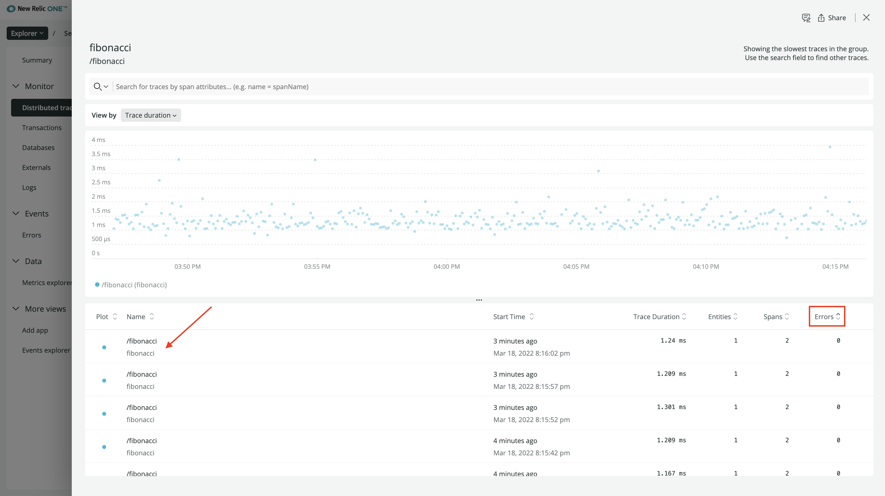

For now, you’re going to view a trace with no errors. You’ll investigate traces with errors in the next lesson.

In this new view, you see the timeline of the spans in your trace:

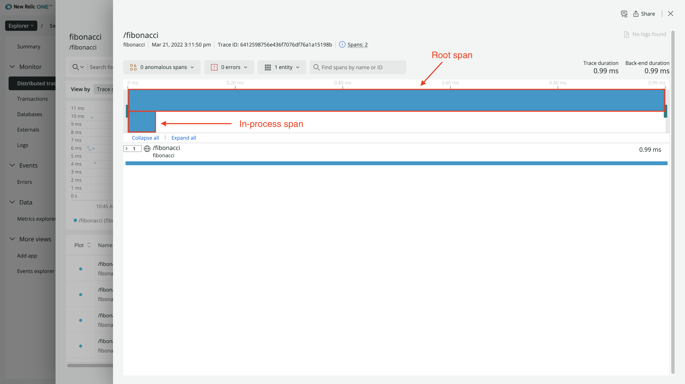

There are two blue blocks, one for each span. The blue color means that the span does not have an error status.

The span on top is the root span. It’s the one named “HTTP GET”:

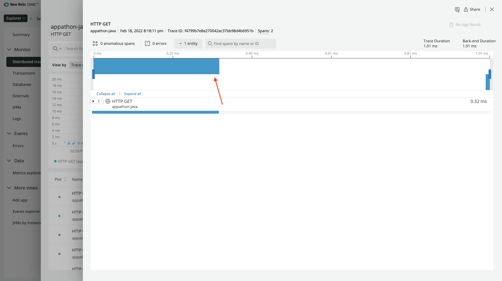

The bottom span is an **in-process** span. In New Relic, this means that it represents an internal function call, and that it's neither an exit nor entry span for the service:

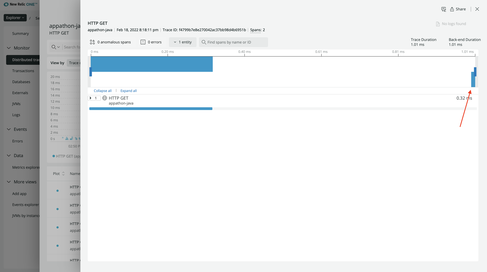

In the chart below the timeline, you only see the root span.

</Step>

<Step>

Click the root span:

In the information panel on the right side of the view, you see granular information about the span.

The tab selected by default shows the performance of spans in your service. It shows data about the duration of spans as well as the throughput.

</Step>

<Step>

Click **Attributes**:

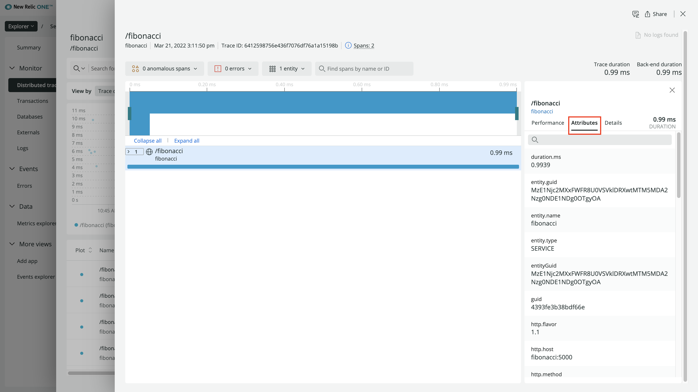

Here, you see all the attributes that you set manually, along with attributes set automatically by the OpenTelemetry instrumentation you used. For example, the span’s `instrumentation.provider` is `opentelemetry` and the `service.name` is the name of your service.

Notice that you’re still missing some information, such as your attribute, `oteldemo.n`, for the `n` value your user requested. It’s not listed here because you captured that information in the span for the function that computes the nth fibonacci number, not the root span. To see that, look at your in-process span.

</Step>

<Step>

Expand the root span, and toggle **Display in-process spans for this service**:

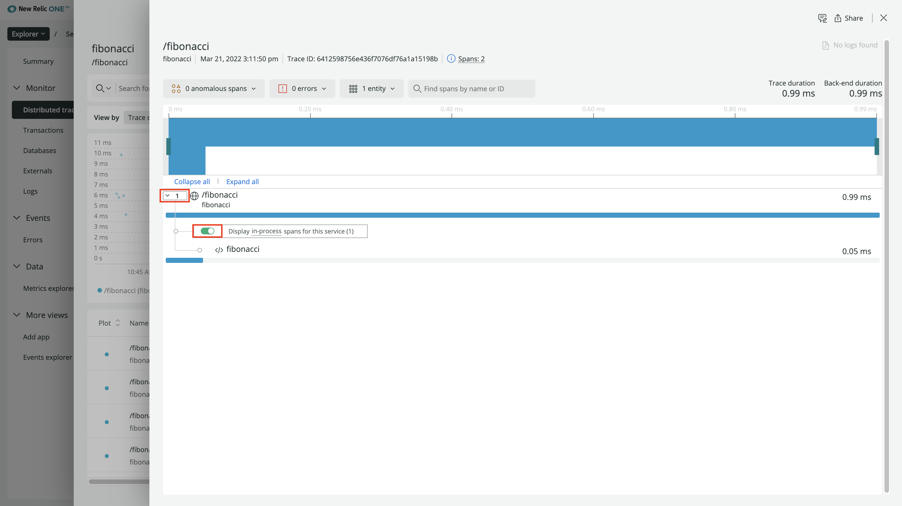

</Step>

<Step>

Click your in-process span:

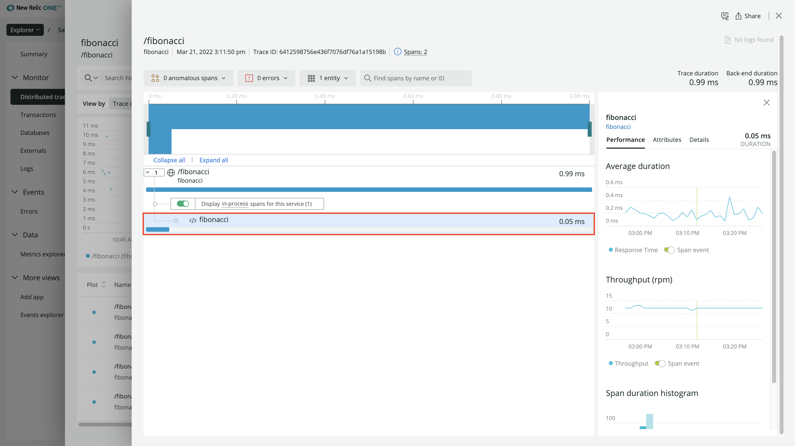

This view is the same as the view for your root span but with data for your function instead of the overall request. Under **Attributes**, you’ll find your custom attributes:

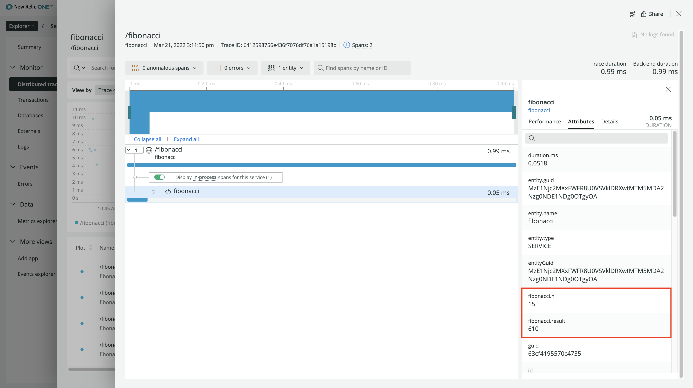

With span attributes, you can understand what happened while your code was running.

In some cases, though, your code may raise exceptions. When you instrumented your application, you handled an exception where the user requested an out-of-bounds fibonacci index.

You can find these error spans in the **Distributed tracing** view by reordering the rows by **Errors**:

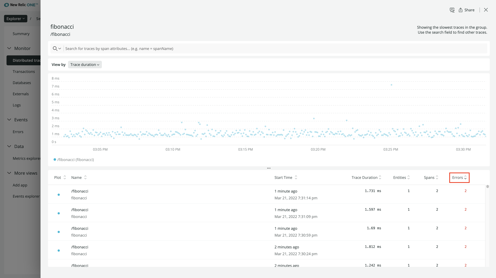

</Step>

</Steps>

However, we also provide a dedicated view that filters down these traces for you.

<Callout variant="course">

This lesson is a part of our OpenTelemetry masterclass. Continue on to the next lesson: [View your error traces](/opentelemetry-masterclass/hands-on/error-traces).

</Callout>
