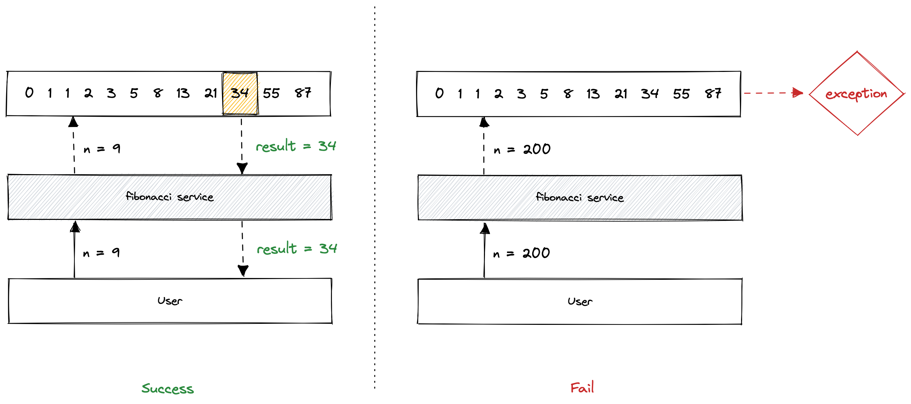

<Callout variant="course">

This lesson is a part of our OpenTelemetry masterclass. If you haven't already, checkout the [chapter introduction](/opentelemetry-masterclass/hands-on).

</Callout>

For this workshop, we’ve created a GitHub repository that contains a single web application implemented in a variety of popular programming languages. This app has one endpoint that takes an integer value, `n`, and returns the nth fibonacci number. For example, if you request `/fibonacci?n=9`, the app returns the ninth number in the fibonacci sequence: 34.

However, it only computes the numbers in the sequence from indices 1 to 90. If you request a number outside this range, the app raises an error:

<Callout variant="course">

This lesson is a part of our OpenTelemetry masterclass. We’ve included multiple languages in this workshop so that you can choose the one you’re most comfortable with:

- [.NET](/opentelemetry-masterclass/hands-on/workshop-dotnet)

</Callout>
