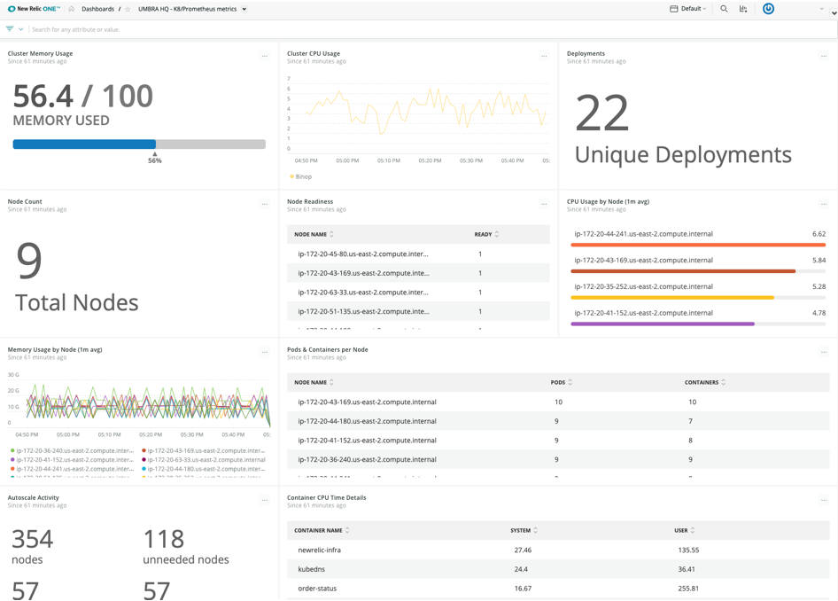

<Intro>

With NRQL, you can query any of the default event data being reported by New Relic, plus any custom events and attributes you’ve added.

</Intro>

<Steps>

<Step>

NRQL syntax is comparable to ANSI SQL.

[Learn mroe about NRQL syntax](https://docs.newrelic.com/docs/insights/nrql-new-relic-query-language/using-nrql/introduction-nrql)

```sql copy=false
SELECT function(attribute) [AS 'label'][, ...]
  FROM event
  [WHERE attribute [comparison] [AND|OR ...]][AS 'label'][, ...]
  [FACET attribute | function(attribute)]
  [LIMIT number]
  [SINCE time]
  [UNTIL time]
  [WITH TIMEZONE timezone]
  [COMPARE WITH time]
  [TIMESERIES time]
```

</Step>

<Step>

NRQL queries can be as simple as fetching rows of data in a raw tabular form to inspect individual events.

[Learn what events New Relic agents provide out of the box](https://docs.newrelic.com/docs/insights/insights-data-sources/default-data/insights-default-data-other-new-relic-products)

```sql
-- Fetch a list of New Relic Browser PageView events
SELECT * FROM PageView
```

</Step>

<Step>

NRQL queries can also do extremely powerful calculations before the data is presented to you, such as crafting funnels based on the way people actually use your website.

[Learn more about NRQL funnels](https://docs.newrelic.com/docs/insights/nrql-new-relic-query-language/nrql-query-examples/funnels-evaluate-data-series-events)

```sql
-- See how many users visit, signup, browse and purchase from your site as a funnel
SELECT funnel(session,
  WHERE pageUrl='http://www.demotron.com/' AS 'Visited Homepage',
  WHERE pageUrl='http://www.demotron.com/signup' AS 'Signed Up',
  WHERE pageUrl='http://www.demotron.com/browse' AS 'Browsed Items',
  WHERE pageUrl='http://www.demotron.com/checkout' AS 'Made Purchase')
  FROM PageView
  SINCE 12 hours ago
```

</Step>

<Step>

Using NRQL, you can customize your New Relic experience by crafting diverse dashboards in New Relic One that show your data from multiple angles. These dashboards can be shared with technical and non-technical stakeholders alike.



</Step>

</Steps>

<br />

---

## Learn more and start building

### Documentation

For an overview of NRQL syntax, see [Introduction to NRQL](https://docs.newrelic.com/docs/insights/nrql-new-relic-query-language/using-nrql/introduction-nrql). For a detailed description of all available functions, see [NRQL syntax, components, and functions](https://docs.newrelic.com/docs/insights/nrql-new-relic-query-language/nrql-resources/nrql-syntax-components-functions).

### NRU Tutorials

To learn how to query and narrow a large data store by a specific parameter, watch the tutorial on [Filtering queries with NRQL](https://learn.newrelic.com/writing-nrql-queries).

### Community Forum

Connect with other developers in the [New Relic Explorers Hub](http://discuss.newrelic.com/tags/developer).

### GitHub

For examples of integrations and other technologies, check us out on [GitHub](https://github.com/newrelic).
