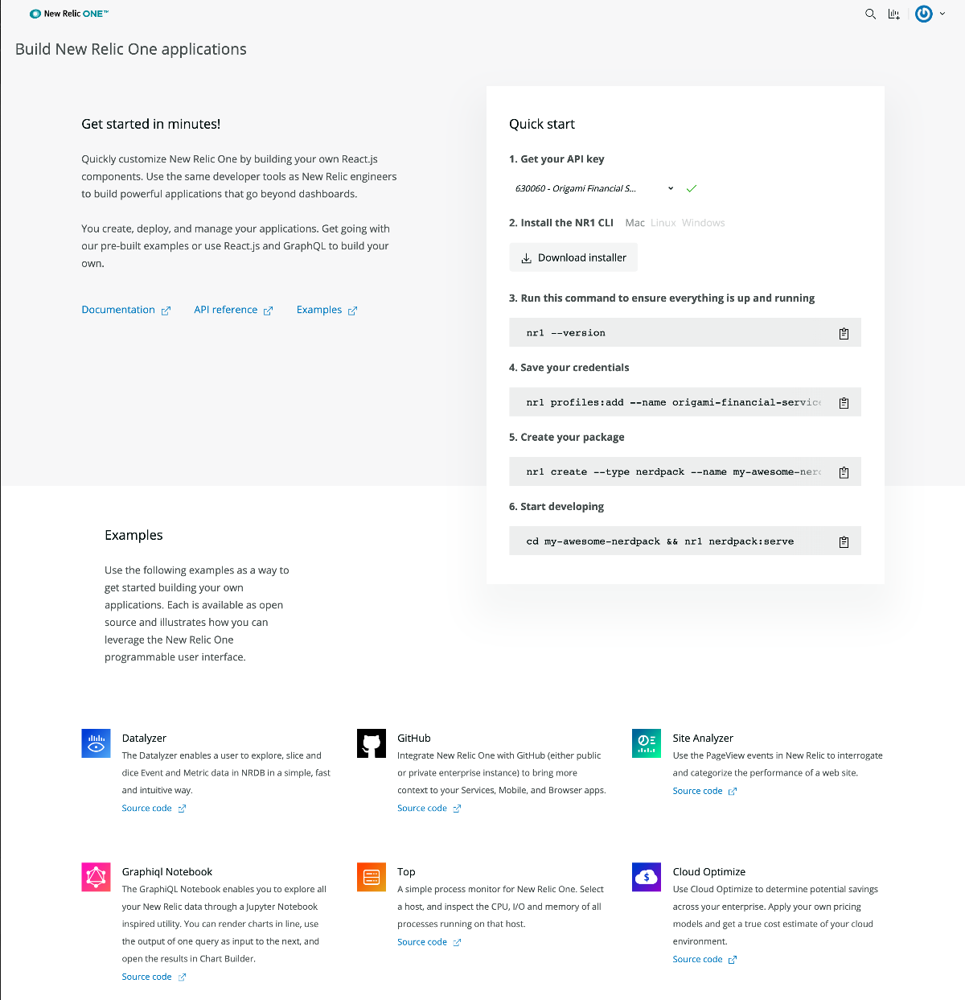

<Intro>
To build a [New Relic One app](/use-cases/build-new-relic-one-applications), you must install the New Relic One CLI. The CLI helps you build, publish, and manage your New Relic app.

</Intro>

To build a [New Relic One app](/use-cases/build-new-relic-one-applications), we provide you with a variety of tools, including the New Relic One CLI (command line interface). This page will explain how to use [CLI commands](/build-tools/new-relic-one-applications/cli#Commands) to:

-   Generate Nerdpack/Nerdlet templates

-   Locally serve Nerdpacks (when developing)

-   Publish and deploy

-   Subscribe to Nerdpacks

-   Add screenshots and metadata to the New Relic One Catalog

## Installing the New Relic One CLI

### Install using 'Build your own application' launcher

From *within* New Relic, go to the [**Build your own application** launcher](https://one.newrelic.com/launcher/developer-center.launcher) and follow the instructions. This launcher will automatically generate an API key for the account you select, and give you the pre-populated commands to create a profile, generate your first "Hello World" app, and serve it locally. 

### Download from Developer site

Alternately, you can follow the steps below. However, you will need to to create your New Relic [personal API Key](https://docs.newrelic.com/docs/apis/get-started/intro-apis/types-new-relic-api-keys#personal-api-key), which you can create from the **Account settings** of your New Relic account. Keep this key handy because you will need it when you create the profile used by the CLI.

<Steps>
<Step>
Download the CLI from [this link](/launcher/developer-center.launcher) and install it. Check to make sure the CLI is installed properly by issuing simply checking the version.

`nr1 --version`
</Step>

<Step>
The CLI allows you to have multiple profiles. Each profile has a distinct API key and region. This is helpful if you have multiple accounts, or different API keys for different applications. To create a profile, execute the following command, substituting in the name you desire, your persona API key, as well as the region. The default is the 'us'. 

`nr1 profiles:add --name <profile name> --api-key <personal api key> --region us`

</Step>

<Step>
Now you are ready to create a simple "Hello World" app. Because we are all data nerds, we sometimes refer to apps as 'nerdpacks.'

`nr1 create --type nerdpack --name my-awesome-nerdpack`

</Step>

<Step>
Once the app is created, all you need to do is change into the directory and start the local server. 

`cd my-awesome-nerdpack && nr1 nerdpack:serve`
</Step>

</Steps>

## New Relic One CLI Commands

This table gives descriptions and context for some of the most important CLI commands. For details on user permissions, see [Authentication and permissions](/build-tools/new-relic-one-applications/guide-to-authentication--data-access--and-permissions).

| Topic | Command | Description |
| --- | --- | --- |
| Help | `nr1 help` | See all `nr1` commands. For more details about a command, run `nr1 help COMMAND_NAME`. |
| autocomplete | `nr1 autocomplete` | Displays autocomplete installation instructions. |
| Set CLI config | `nr1 config:set` | Sets a secific configuration value. |
| Get CLI config | `nr1 config:get` | Shows a secific configuration. |
| list CLI config | `nr1 config:list` | Lists your configuration choices. |
| Delete CLI config | `nr1 config:delete` | Removes the value of a specific configuration. |
| Update | `nr1 update` | Update to newest version of the CLI. |
| Profiles | `nr1 profiles` | Controls the profile you'll be running CLI commands as. You can have more than one profile, which is helpful for executing commands on multiple New Relic accounts. For more on this, see [Authentication](/client-side-sdk/index.html#cli/Authentication) and [the workshop](https://github.com/newrelic/nr1-workshop/blob/master/lab-cli/INSTRUCTIONS.md). |
| Create | `nr1 create` | Create a new component template (Nerdpack, Nerdlet, launcher, or catalog). The CLI will walk you through this process. For an explanation of the file structure, see [Nerdpack file structure](https://docs.newrelic.com/docs/new-relic-one/use-new-relic-one/build-new-relic-one/new-relic-one-application-nerdpack-file-structure). |
| Clone | `nr1 nerdpack:clone` | Clone an [open source Nerdpack from our GitHub repository](/open-source/nerdpacks). |
| Serve locally | `nr1 nerdpack:serve` | Serves your Nerdpack locally, which makes it visible at [one.newrelic.com/?nerdpacks=local](https://one.newrelic.com/?nerdpacks=local). For details, see [Local development](/client-side-sdk/index.html#cli/LocalDevelopment). |
| Change associated accounts | `nr1 nerdpack:uuid` | Commands related to the Nerdpack's UUID (universal unique ID). This ID dictates the data a Nerdpack has access to, and who can subscribe to it. To deploy a Nerdpack you didn't make, you'll have to assign it a new UUID. For details, see [Access to data](/build-tools/new-relic-one-applications/guide-to-authentication--data-access--and-permissions#Appaccesstodata) and [the workshop](https://github.com/newrelic/nr1-workshop/blob/master/lab-cli/INSTRUCTIONS.md). |
| Publish | `nr1 nerdpack:publish` | Publishes your Nerdpack to New Relic. For more on publishing, see [Deploy to New Relic One](/build-tools/new-relic-one-applications/publish-deploy). After publishing, you can use `nr1 nerdpack: deploy` to deploy it to a channel and make it available to users. |
| Deploy a Nerdpack | `nr1 nerdpack:deploy` | Deploys a Nerdpack version to a specific channel (for example, BETA, or STABLE). A channel can only have one Nerdpack version deployed to it at one time. If a channel has an existing Nerdpack associated with it, deploying a new Nerdpack version to that channel will undeploy the previous one. For more on deploying, see [Deploy to New Relic One](/build-tools/new-relic-one-applications/publish-deploy). |
| Get Catalog info | `nr1 catalog:info` | Shows the information about your application that's displayed in the New Relic One Catalog. |
| Submit Catalog information | `nr1 catalog:submit` | Gathers the information you add to the `catalog`directory for your application and saves it to the New Relic One Catalog. See [New Relic One Catalog docs](https://docs.newrelic.com/docs/new-relic-one/use-new-relic-one/build-new-relic-one/discover-manage-applications-new-relic-one-catalog#add_images_metadata_to_apps) for details on adding screenshots and metadata to your applications to make them easy to find, attractive, and informative. |
| Subscribe | `nr1 nerdpack:subscribe` | Subscribes an account (the one associated with the API key used to run this command) to a channel (default: STABLE). Can be run with a Nerdpack UUID or run in a specific Nerdpack's directory (the UUID in package.json file is used). An account can only be subscribed to one Nerdpack channel at a time. For more details, see [Deploy to New Relic One](/build-tools/new-relic-one-applications/publish-deploy#Subscribe). |
| Unsubscribe | `nr1 nerdpack:unsubscribe` | Unsubscribes an account from a Nerdpack whose UUID you provide. The account unsubscribed is the one associated with the API key used to run the command. |
| NRQL query | `nr1 nrql` | Fetches data from New Relic using [NRQL](https://newrelic.com/docs/query-data/nrql-new-relic-query-language/getting-started/introduction-nrql) (New Relic query language). |
| Install a plugin | `nr1 plugins:install` | Installs a plugin into the CLI. |
| Link a plugin | `nr1 plugins:link` | Links a plugin into the CLI for development. |
| Update a plugins | `nr1 plugins:update` | Updates your installed plugins. |
| Uninstall a plugin | `nr1 plugins:uninstall` | Removes a plugin from the CLI. |
| Subscribe to a Nerdpack | `nr1 subscription:set` | Subscribes your account to a Nerdpack and channel. |
| List subscriptions | `nr1 subscription:list` | Lists all the Nerdpacks your account is subscribed to. |
| Unsubscribe from Nerdpacks | `nr1 subscription:unset` | Unsubscribes your account from a Nerdpack. |

### Publish and deploy

For details on how to publish and deploy, see [Deploy an app](/build-tools/new-relic-one-applications/publish-deploy).